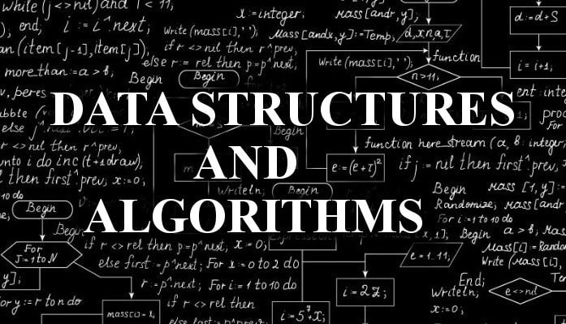

<p align='center'>
    
    </img>
</p>

<br/>

# Data Structures and Algorithms

This repository contains comprehensive resources for the Data Structures and Algorithms course, including:

- **Lab Assignments**: Hands-on exercises designed to reinforce key concepts and practical skills in data structures and algorithms.
- **Lecture Slides**: Downloadable presentations covering essential topics to aid in your understanding and review.

## Features

- **Organized Structure**: Materials are organized by week and topic for easy navigation.
- **Educational Focus**: Resources are tailored for both students and educators to enhance learning outcomes.

## Usage

Feel free to explore the materials, complete the lab assignments, and review the lecture slides to deepen your knowledge of data structures and algorithms.


<br/>
<br/>

## License

© [2024] [Nguyen Thanh Dang]. All rights reserved.

This repository and its contents, including but not limited to lab assignments, lecture slides, and any associated materials, are for educational purposes only. 

**No part of this repository may be copied, reproduced, or distributed without explicit permission from the copyright holder.**

For inquiries, please contact [```dangnguyen.uit@gmail.com```].